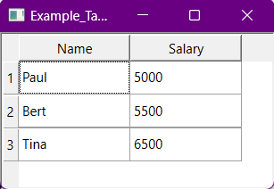

#  A Qt Driver Plugin for DuckDB
Implements a [driver plugin for Qt's SQL Databases](https://doc.qt.io/qt-6/sql-driver.html) for [DuckDB](https://duckdb.org/).  
Just copy the .dll/.so to your Qt plugin file and you can add a "DUCKDB" database at any time. No other dependencies are required. You can use the full capabilities of DuckDB in your Qt program.

It also enables you to use duckdb in an easy way with Qt and Qt widgets, see the example below.

Exmaple for creating a in memory database:
```cpp
QSqlDatabase db = QSqlDatabase::addDatabase("DUCKDB");
db.setDatabaseName("test.db"); // creates a persistent database file "test.db"
db.open(); 
db.exec("CREATE TABLE employee (Name VARCHAR, Salary INTEGER);");
```

You can also use it to load csv or parquet (if duckdb was compiled with parquet support) files:
```cpp
QSqlDatabase db = QSqlDatabase::addDatabase("DUCKDB");
db.open(); // no database name given -> creates a in-memory database
db.exec("CREATE TABLE new_tbl AS SELECT * FROM read_csv_auto('my_csv.csv');";
```

## Example

In order to show a widget with a Sql content, you can use [`QSqlTableModel`](https://doc.qt.io/qt-6/qsqltablemodel.html).

Here is an example on how to use the built-in Qt widget to show the contents of a DuckDB database in a grid widget

```cpp

    QSqlDatabase db = QSqlDatabase::addDatabase("DUCKDB");

	db.open();
	db.exec("CREATE TABLE employee (Name VARCHAR, Salary INTEGER);");
  	db.exec("CREATE TABLE employee (Name VARCHAR, Salary INTEGER);");
	db.exec("INSERT INTO employee VALUES ('Paul', 5000);");
	db.exec("INSERT INTO employee VALUES ('Bert', 5500);");
	db.exec("INSERT INTO employee VALUES ('Tina', 6500);");

	QSqlTableModel *model = new QSqlTableModel(nullptr, db);
	model->setTable("employee");
	model->select();

	QTableView *view = new QTableView;
	view->setModel(model);
	view->show();
```

Which results in the following widget:  


Full example can be found in the [example directory](./examples/TableWidget/## )

## Build requirements
- [DuckDB](https://duckdb.org/) >= 0.7.1 (Included in this repo as submodule. just select your version there)  
- [Qt6](https://www.qt.io/) (Version 5 should be possible, just cmake needs some minor adjustments)

DuckDB will be linked statically.  


For pre-build dlls, please choose the right version (See [Qt Doc about plugin version](https://doc.qt.io/qt-6/deployment-plugins.html#loading-and-verifying-plugins-dynamically))  
tl;dr: don't use the plugin on Qt version below the version it was build for.


## License
Based on [Qt's](https://www.qt.io/) sqlite driver code, which is licensed under the LGPL v3.  
Based on [DuckDB](https://duckdb.org/) under the MIT license.  
[LGPL v3](./LICENSE)
