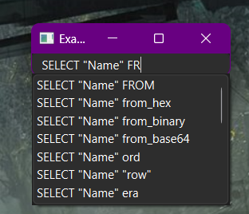

# AutoCompletion

Creates a simple line edit widget with an attached [QCompleter](https://doc.qt.io/qt-6/qcompleter.html).
Uses DuckDBs auto completion capabilities to complete the input.

Requires loading of "autocomplete" extension.
You can do this for example by building DuckDB with it. You can do that by defining the cmake variable `-DBUILD_EXTENSIONS="autocomplete"` when building the driver.

For more info, have a look at [DuckDB Extension Documentation](https://github.com/duckdb/duckdb/tree/main/extension)

