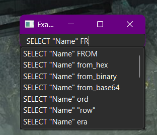

# AutoCompletion

Creates a simple line edit widget with an attached [QCompleter](https://doc.qt.io/qt-6/qcompleter.html).
Uses DuckDBs auto completion capabilities to complete the input.

Requires DuckDB's `autocomplete` extension.
The bundled DuckDB build enables it by default. If you override DuckDB's extension list manually, make sure `autocomplete` stays included. You can add/remove extensions to QtDuckDB via the cmake variable `QTDUCKDB_DUCKDB_EXTENSIONS`.

For more info, have a look at [DuckDB Extension Documentation](https://github.com/duckdb/duckdb/tree/main/extension)
