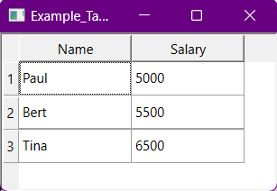

# TableWidget

Creates a simple table widget composed from [QTableView](https://doc.qt.io/qt-6/qtableview.html) 
and [QSqlTableModel](https://doc.qt.io/qt-6/qsqltablemodel.html) using the duckdb driver.

On how to use QSqlTableModel, please have a look into the [Qt documentation](https://doc.qt.io/qt-6/qsqltablemodel.html#details).

